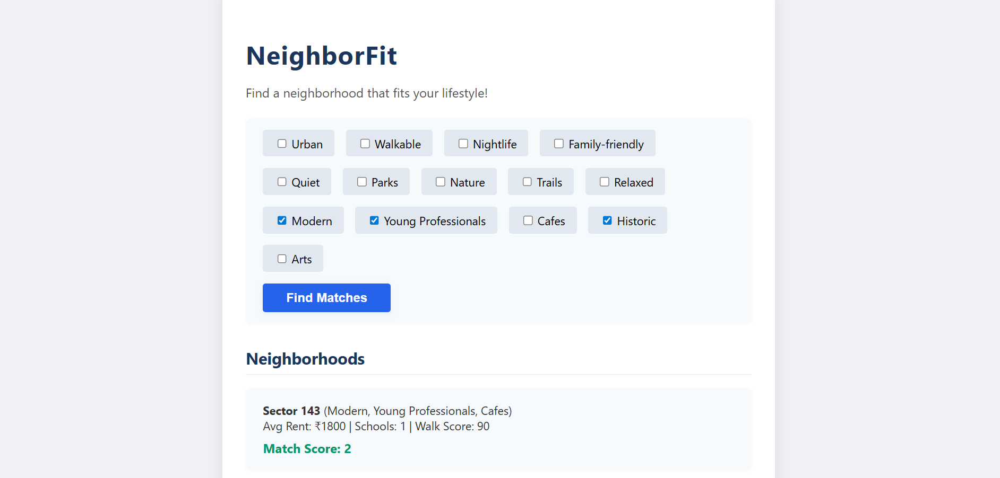
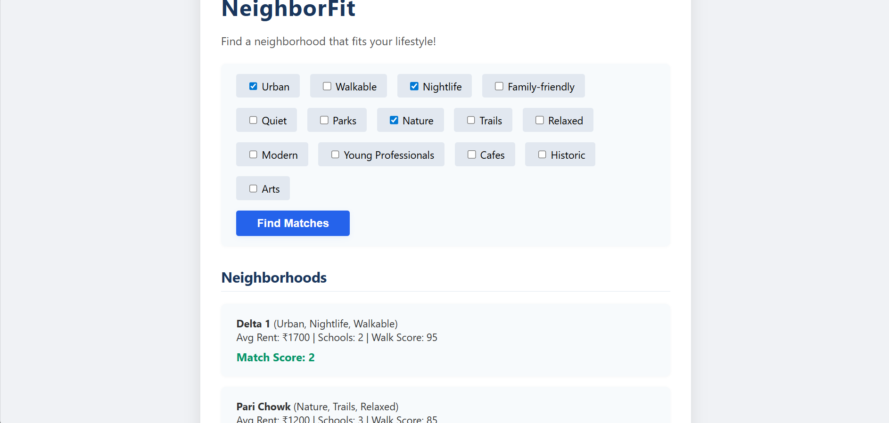

# Problem Analysis & Research

## Problem Definition
People want to find neighborhoods that match their lifestyle (e.g., family-friendly, nightlife, parks), but most tools are too generic or don't use real data.

## User Research
- Reviewed forums and social media to see what people look for in neighborhoods.
- Common needs: safety, affordability, lifestyle fit, amenities.

## Existing Solutions & Gaps
- Niche, WalkScore, and Zillow provide some info, but don't personalize results based on multiple lifestyle preferences.
- Most don't use local or user-specific data.

## Hypotheses
- Users who value "parks" and "quiet" will prefer neighborhoods with those features.
- A simple keyword-matching algorithm can help users find better fits.

## Data Sources
- Custom dataset stored in MySQL, based on real and sample neighborhood data.

## Validation
- Tested the algorithm with different preferences and checked if results matched expectations.

## Screenshots

### Matching Results

### Matching Results

### Matching Results

## How the Matching Algorithm Works

- Users select lifestyle preferences (e.g., “Modern”, “Parks”).
- The backend scores each neighborhood: +1 for each matching keyword in the neighborhood’s lifestyle.
- Results are sorted by match score and shown to the user.